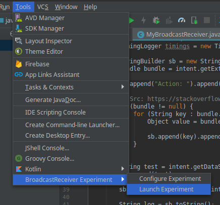
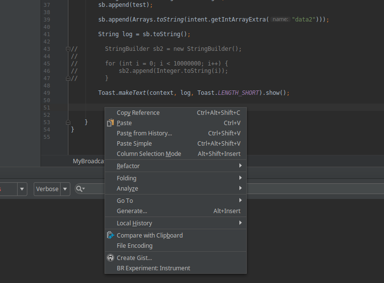

# Broadcast Receiver Plugin
Automated experiment execution of broadcast receivers for Android Studio

## Install
This tool is only tested on Linux Mint.

To build the tool, you'll need:
- IntelliJ IDEA
- JDK 8

To install the tool, you'll need:
- Android Studio

To run the tool, you'll need:
- Python 2.7
- Android Debug Bridge

## Quick start
Install the build plugin in Android Studio and restart.

To configure the experiment in Android Studio, navigate to Tools->BroadcastReceiver Experiment->Configure Experiment

To launch the experiment in Android Studio, navigate to Tools->BroadcastReceiver Experiment->Launch Experiment



To instrument the broadcast receiver for the experiment, right click on where the OnReceive method code ends, and navigate to BR Experiment: Instrument. This adds timingLogger code for measuring execution time.

Note: Build APK before you launch the experiment.



The current manually work flow of the plugin is shown in the image below:


## Configuration File
Configure Experiment creates a JSON file.
It consists of two parts: Configuration and IntentDescription

### Configuration
Below is a reference to the fields for the Configuration.

**ADBPath** *string*
Path to ADB

**APK** *string*
Path to the APK you have build, must include timingLogger code.

**Package** *string*
Package Name of APK

**Activity** *string*
Main Activity name of APK

**Repitition** *int*
Number of times triggering the broadcast receiver

**Delay** *int*
Delay between each repitition

### IntentDescription
Below is a reference to the fields for the IntentDescription.

**setAction** *string*
Intent Action name

**setComponent**
(Optional) Atrribute for specifying explicit Intent
* **Package** *string*
Name of package that should receive Intent
* **Class** *string*
Name of class that should receive the Intent

**setData** *string*
(Optional) Sets data of Intent. Overwrites setType

**setType** *string*
(Optional) Sets explicit MIME data type. Overwrites setData

**setDataAndType**
(Optional) Sets both data attribute and explicit MIME data type. Should be used if both are needed to be set
* **setData** *string*
* **setType** *string*

**putExtra**
(Optional) Adds extra data to the Intent
* **Name** *string*
Extra field identifier
* **Value** *string or string array*
Extra field data. Value formatting depends on the Type field.
* **Type** *string*
Data type of Value. Supports String, CharSequence, char, int, long, short, float, double, boolean, byte and array versions of them.

**addCategory** *string array*
(Optional)  Adds additional detail to Intent in form of a new category

**addFlags** *string array*
(Optional) Adds flags to Intent. Accepts only specific String values. See [Intent Reference](https://developer.android.com/reference/android/content/Intent)

**permission** *string*
(Optional) Adds permission to Intent. The broadcast receiver has to allow this permission to receive the Intent

### Example configuration file
```json
{
    "Configuration" : {
        "ADBPath" : "~/Android/Sdk/platform-tools/adb",
        "APK" : "~/BroadcastReceiverTestApp/app/build/outputs/apk/debug/app-debug.apk",
        "Package" : "com.test.broadcastreceivertestapp",
        "Activity" : "MainActivity",
        "Repetitions" : 10,
        "Delay" : 30
    },
    "IntentDescription" : {
        "setAction" : "com.test.myaction",
        "setComponent" : {
            "Package" : "com.test.broadcastreceivertestapp",
            "Class" : "com.test.broadcastreceivertestapp.MyBroadcastReceiver"
        },
        "putExtra" : [
            {
                "Name" : "extraString",
                "Value" : "Hello World!",
                "DataType" : "String"
            },
            {
                "Name" : "extraInt",
                "Value" : [233, 345],
                "DataType" : "int[]"
            }
        ]
    }
}
```